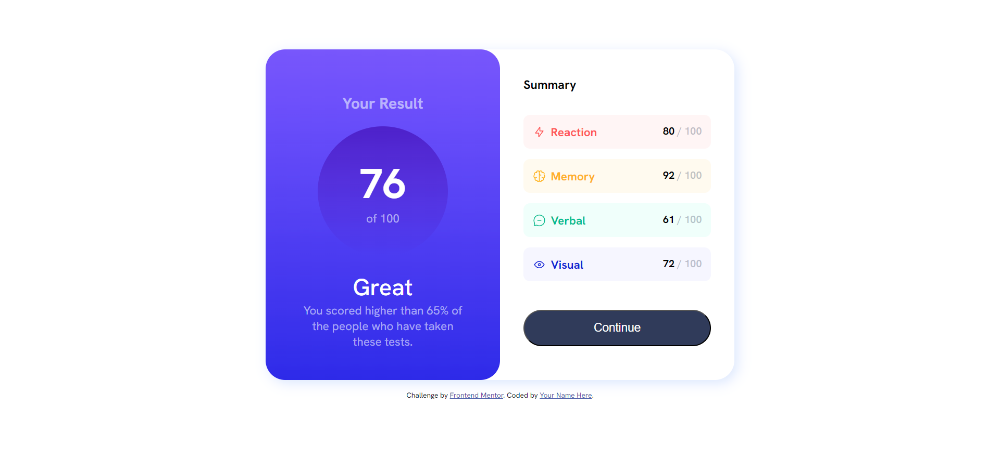
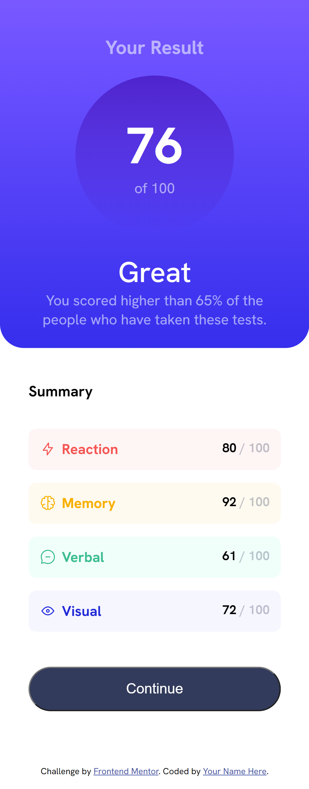

# Frontend Mentor - Results summary component solution

This is a solution to the [Results summary component challenge on Frontend Mentor](https://www.frontendmentor.io/challenges/results-summary-component-CE_K6s0maV). Frontend Mentor challenges help you improve your coding skills by building realistic projects. 

## Table of contents

- [Overview](#overview)
  - [The challenge](#the-challenge)
  - [Screenshot](#screenshot)
  - [Links](#links)
- [My process](#my-process)
  - [Built with](#built-with)
  - [What I learned](#what-i-learned)
  - [Continued development](#continued-development)
  - [Useful resources](#useful-resources)
- [Author](#author)
- [Acknowledgments](#acknowledgments)

**Note: Delete this note and update the table of contents based on what sections you keep.**

## Overview

### The challenge

Users should be able to:

- View the optimal layout for the interface depending on their device's screen size
- See hover and focus states for all interactive elements on the page
- **Bonus**: Use the local JSON data to dynamically populate the content

### Screenshot




### Links

- Live Site URL: [femt-results-summary-component](https://mpluggie7.github.io/femt-results-summary-component/)

## My process

### Built with

- Semantic HTML5 markup
- CSS custom properties
- Flexbox
- Mobile-first workflow
- [Styled Components](./style.css) - For styles

### What I learned

I have learned how to use the color gradient and color with hsl and hsla

```css
:root {
  --White: hsl(0, 0%, 100%);
  --Pale_blue: hsla(221, 100%, 96%, 0.6);
}
```

### Continued development

In the same way, I will continue learning.

### Useful resources

## Author

- Website - [megamaxo-app](https://www.megamaxo-app.com)
- Frontend Mentor - [@Mpluggie7](https://www.frontendmentor.io/profile/Mpluggie7)

## Acknowledgments
